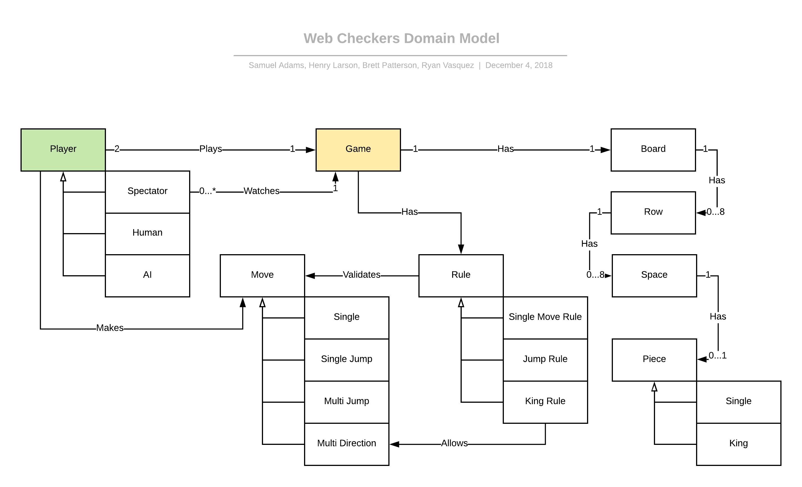

# Web Checkers Design Documentation

## Team Information
* Team name: Team D
* Team members
    * Samuel Adams
    * Henry Larson
    * Brett Patterson
    * Ryan Vasquez

## Executive Summary
This is a web-based application where players, who are signed in, have the ability to play checkers with other players.
 The user interface for the game will implement drag-and-drop functionality for making moves. Furthermore, the 
 additional features of "Spectator Mode" and "Tournament Play" will be implemented to enhance the user experience.

### Purpose
Web Checkers exists to allow users of all skill levels to play a web-based version of checkers. This enables
individuals to play with others in different locations, instead of limiting them to a face to face board game.
Whether someone is interested in playing against a friend or even just a player in the lobby they've never met 
before, Web Checkers offers a fun and challenging way to pass time. 

### Glossary and Acronyms
| Term | Definition |
|------|------------|
| VO | Value Object 
| Web-based application | A web-based application is a program that is accessed over a network connection using HTTP, rather than existing within a device's memory. |
| Pure Fabrication pattern | A Pure Fabrication is a set of responsibilities held within a separate class that does not represent an entity in the model. |
| User Interface (UI) | The means by which a user and a program interact. |
| HTTP | HyperText Transfer Protocol|
| HTML | HyperText Markup Language |
| Spark | open-source web application framework |
| CSS (Cascading Style Sheet) | A style sheet language used for describing the presentation of a document written in a markup language like HTML. |
| UI Controller | Object that coordinates system operations |
## Requirements
* Player must be able to sign in.
* Player must be able to play against another player who is also signed in.
* American rules of checkers must be implemented into the game.
* Either player must be able to resign, at any point, which ends the game.

### Definition of MVP
The Minimum Viable Product should allow the user to sign in to a web-based system, play a game of checkers through the 
American rules, and resign at any point which ends the game.

### MVP Features

###### Epics: 
* Checker movement
* Resignation

###### User Stories: 
* Move first
* Move on turn
* Single move
* Multi direction
* Single jump move
* Multi jump move
* Resignation

### Roadmap of Enhancements
* Spectator: User can enter a game already in progress and watch, but not play.

* Tournament play: User can choose to play in tournament mode, where a group of players compete in a system of games
that ends with one winner. 

## Application Domain
This section describes the application domain:

:
_(Figure 1)_

The main elements of the domain are the Player, Game, and Tournament entities. The Player entity represents the player,
whether they are human, a spectator, or an AI bot. A player plays the game and makes moves, but only watches if they are
a spectator. The Move entity has multiple sub-types: single, single jump, multi jump, and multi direction moves. Each 
move is validated by the rules of the game. The jump rule determines the validity of all the moves besides the multi 
direction move, which is validated by the king rule. Before the player can even make a move, the board must be created.
The Game entity creates a Board, which then creates eight Row entities, which creates eight Space entities for each row. The Space
entity creates a single Piece entity if it is initialized to contain one. There are two types of pieces: single pieces
and king pieces. A Tournament entity is a series of games played by multiple different players. The functionality of the
tournament follows the basic principle of a regular sports tournament.

## Architecture and Design
The Web Checkers webapp uses a Java-based web server and was built using the Spark web micro framework and the 
FreeMarker template engine to handle HTTP requests and generate HTML responses.

### Summary
The following Tiers/Layers model shows a high-level view of the webapp's architecture:

:
_(Figure 2)_

As a web application, the user interacts with the system using a
browser.  The client-side of the User Interface is composed of HTML pages with
some minimal CSS for styling the page.  There is also some JavaScript
that has been provided to the team by the architect.

The server-side tiers include the User Interface Tier that is composed of User Interface Controllers and Views.
Controllers are built using the Spark framework and View are built using the FreeMarker framework.  The Application and 
Model tiers are built using plain-old Java objects (POJOs).

Details of the components within these tiers are supplied below.

### Overview of User Interface
This section describes the web interface flow; this is how the user views and interacts
with the WebCheckers application: 

:
_(Figure 3)_

From the Perspective of the user, the Application's user interface begins on the home page
where the user will see a welcome screen and a button to sign in. When the user clicks the button,
the interface then flows to the sign-in page, where the user is prompted to enter a unique name.
If the user enters an invalid name or a name that's already being used, the user will stay on the sign-in
page but with the appropriate error message. If the user enters a valid name, the interface flows back to the home page,
where the user can see his name as the current player, along with a number or list of other players in the lobby. When 
the user chooses a player to enter a game with or a different player chooses the user to play a game with, 
the user is transitioned to the game page, where the board is laid out in game form. If a player wins or 
if either player resigns, both are taken back to the home page.  

### UI Tier
This tier of the Web Checkers application can be shown in the following class diagram:

:
_(Figure 4)_

The User Interface Tier of Web Checkers begins with WebServer, which is responsible for initializing all of the HTTP 
Routes that make up the web application. When a client navigates to the Web Checkers page, he will be starting in the 
GetHomeRoute component of the UI Tier. If client attempts to start at a page that is not the home page, the client will 
be redirected to the sign in page. GetHomeRoute is responsible for displaying the home page, with a Sign In button at 
the top and additional information in the body, as well as checking if a player is already in a game and redirecting to 
the game page if so. When the Sign In button is clicked, the client will be sent to GetSignInRoute, which is responsible
for displaying the sign in page. On the sign in page, the client can type a name into the space provided and press the 
submit button, which will send the client to PostSignInRoute. In PostSignInRoute, if the username is invalid or already 
taken, the user will remain on the sign in page but with an error message; if the username is valid and unique, the 
player will be signed in and redirected back to the home page. This process of signing in, from the perspective of the
User Interface, can be seen in the following sequence diagram:

:
_(Figure 5)_

Back in GetHomeRoute, the current lobby will now be displayed and, if there is more than one player in the lobby, there 
will be an option to select a player and start a game. Once the client chooses an opponent and clicks the start game 
button, the client is sent to GetGameRoute. GetGameRoute is responsible for creating a match in GameCenter 
(if one does not already exist) and displaying the game page to the client. More about the sign-in process can be found 
in the "Significant Features" section (Figure 11).

### Application Tier
The application tier contains two components: GameCenter and PlayerLobby. These components can be seen in the following class diagram:

: 
_(Figure 6)_

PlayerLobby is responsible for storing all players that have signed in, and in turn is used to check if a player name is valid when a user
is attempting to sign in. Seen in the figure below, when a user submits a username to sign in with, PostSignInRoute asks PlayerLobby to validate
that the username is valid and is not already being used. If the name passes both of these tests, PostSignInRoute adds the new player to PlayerLobby: 

:
_(Figure 7)_

We chose this design so that the responsibility of managing players is kept in a single, non-domain entity, following the principle of Pure Fabrication. 
This supports high-cohesion by keeping classes, like Player or GameCenter, small and with narrowly defined responsibilities.

GameCenter is responsible for managing the matches between players. A match can be created in GameCenter, at which point the match is stored and can be accessed
by other related components. When a player wants to start a game with another signed-in player, the chosen player is checked to see if it is already in a match;
if it is not, a match is created through GameCenter between the two players. After the game is finished, or if a player resigns, GameCenter ends the match. 
This sequence of events involving GameCenter can be seen in the following diagram:

:
_(Figure 8)_

### Model Tier
The Model tier contains 8 components which include:
* Board
* Match
* Message
* Move
* Piece
* Player
* Row
* Space

:
_(Figure 9)_

In the domain model we have a match, which is an object that can start and end a game. A match is compromised of 
two players. A player is an object that has a name and a current match that they are in. A player is not initially 
in a match, but can get pulled into one by another player. A match is responsible for holding a board and both 
players(red and white). A board is an object comprised of 8 rows. Each row is an object which is comprised of 8 spaces.
When a board is being initialized, it iterates through the rows and initializes each of them. In turn, each row 
iterates through the spaces and creates a new piece on each valid space location, this creates the board object. Each piece has 
an an owner: red player or white player, and a type: single or king. These features may be seen in the sequence diagram 
below: 

:
_(Figure 10)_

When a player wants to make a move, the move object holds the responsibility of moving the piece from its starting 
space to ending space. The red player always makes the first move. When a move is available then it must be made, 
the same goes for double jumps. When a move is attempted, the message object lets the board know whether or not the move 
is valid or not. The message will contain a text, and a type: info or error. 

### Significant Features
The process for starting a game can be seen by the following sequence diagram:

:
_(Figure 11)_

This sequence of events begins when a player clicks the "Start A Game" button on the home page, sending the user to GetGameRoute.
In GetGameRoute, the opponent player object is obtained using the name submitted when the initial player clicked the "Start A Game" button.
If the opponent doesn't exist or is already in a game, the player is sent back to the home page with an error message.
If the opponent exists and isn't already in a game, a new match is created in GameCenter with the two players and the player is sent to the game page. 
While this is happening, the opponent is still in GetHomeRoute and consistently checking its status. Once the opponent is added to the match that's
created in GameCenter, the opponent sees that it now exists in GameCenter and sends the user to the game page.  

### Design Improvements
If given the opportunity to improve upon our current design, there are a few design details that we would change.
For example, we have had some issues with our implementation of our board. We created our board using an iterable 
of iterables, this caused some issues in our unit tests. Our tests helped us realize that our implementation could 
have been improved by maybe using a collection when creating our board. Our original code metrics 
measurements were not great, however, after going back and fixing our implementation and unit tests, we were able 
to improve them significantly. Our main issues in testing was our iterators. As you can see, the iterators had caused 
us more than one problem, however, we were able to get past this issue.

## Testing
Some of the tests that are performed: 
checking if the constructors creates the object correctly, stores the attributes accordingly, checking
to see if the getter methods are returning the correct values, seeing if the player is being redirected
appropriately and requests are being halted.

At the current moment, we have the UI tier at 83% code coverage and 92% missed branches.
The model tier is at 89% code coverage and 83% missed branches. 
The application tier is at 100% code coverage and the missed branches is at 100%.

### Acceptance Testing
Currently we have completed and passed all necessary acceptance criteria tests for 
the first two user stories. All acceptance criteria tests for the Player sign-in and start 
game user stories are complete and functional. We are currently working on tests for further 
user stories.

### Unit Testing and Code Coverage
For our unit tests, our goal was to reach at least 90% coverage on all tiers(model, application, and UI). 
We decided on 90% because, it would give us confidence that we are properly implementing the different tiers. 
As we created tests, we began to realize that we had certain coupling issues which we were able to quickly fix. 
This fix was necessary, as these issues were preventing us from creating a proper testing seam between our classes. 
This was due to that fact that we had not followed the Pure Fabrication pattern. These issues helped us improve our 
code, as we realized that hard to test code is code that could use some improvements.