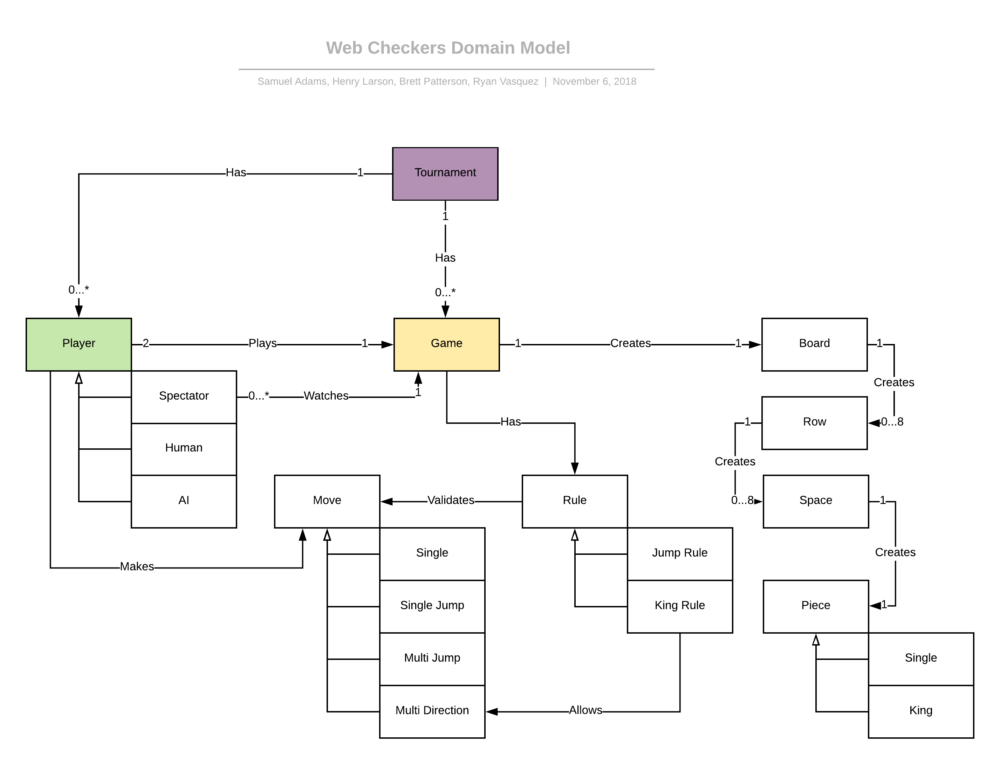

# Web Checkers Design Documentation

__Note: All diagrams are formatted to increase in quality as you zoom in on them. If diagrams are hard to read, simply zoom in and the clarity should improve.__

## Team Information
* Team name: TeamD
* Team members
    * Samuel Adams
    * Henry Larson
    * Brett Patterson
    * Ryan Vasquez

## Executive Summary
This is a web-based application where players, who are signed in, have the ability to play checkers with other players.
 The user interface for the game will implement drag-and-drop functionality for making moves. Furthermore, the 
 additional features of "Spectator Mode" and "Tournament Play" will be implemented to enhance the user experience.

### Purpose
Web Checkers exists to allow users of all skill levels to play a web-based version of checkers. This enables
individuals to play with others in different locations, instead of limiting them to a face to face board game.
Whether someone is interested in playing against a friend or even just a player in the lobby they've never met 
before, Web Checkers offers a fun and challenging way to pass time. 

### Glossary and Acronyms
| Term | Definition |
|------|------------|
| VO | Value Object 
| Web-based application | A web-based application is a program that is accessed over a network connection using HTTP, rather than existing within a device's memory. |
| Pure Fabrication pattern | A Pure Fabrication is a set of responsibilities held within a separate class that does not represent an entity in the model. |
| User Interface (UI) | The means by which a user and a program interact. |
| HTTP | HyperText Transfer Protocol|
| HTML | HyperText Markup Language |
| Spark | open-source web application framework |
| CSS (Cascading Style Sheet) | A style sheet language used for describing the presentation of a document written in a markup language like HTML. |
| UI Controller | Object that coordinates system operations |
| Information Expert | Assigning responsibility to the class that has the information |
| Controller | A non-user interface object responsible for receiving or handling a system event. |

## Requirements
* Player must be able to sign in.
* Player must be able to play against another player who is also signed in.
* American rules of checkers must be implemented into the game.
* Either player must be able to resign, at any point, which ends the game.

### Definition of MVP
The Minimum Viable Product should allow the user to sign in to a web-based system, play a game of checkers through the 
American rules, and resign at any point which ends the game.

### MVP Features

The Minimum Viable Product of the WebChecker Application starts with the feature where a player can sign-in to the WebCheckers player lobby.
From here, a player has the option to either start a game with another player who isn't already in a game or sign-out of the player lobby. When
a player is in a game, the red player will move first and then the players will go back-and-forth taking turns. On a player's turn, they can either
make a single diagonal move, single diagonal jump, or multiple diagonal jump. If the piece is a King Piece, which is achieved when a piece reaches
the last row of the opposite side, then the piece may move both diagonally forwards and diagonally backwards, where as a single piece is restricted to only moving diagonally forwards.
During a game, a player can resign, which ends the game and takes both players back to the lobby, or sign-out, which ends the game and signs out the current player
while the opponent player is taken back to the lobby.

### Roadmap of Enhancements
* Spectator: User can enter a game already in progress and watch, but not play.

* Artificial Intelligence: An AI Player is an object of the application that competitively plays a traditional game of WebCheckers against any player who requests to 
start a game with it.

## Application Domain
This section describes the application domain:

:
_(Figure 1)_

The main elements of the domain are the Player, Game, and Tournament entities. The Player entity represents the player,
whether they are human or a spectator. A player plays the game and makes moves, but only watches if they are
a spectator. The Move entity has multiple sub-types: single, single jump, multi jump, and multi direction moves. Each 
move is validated by the rules of the game. The single move rule validates single moves, the jump rule determines the 
validity of all jump moves, and the king rule validates the multi-direction move. Before the player can even make a move, 
the board must be created. The Game entity creates a Board, which then creates eight Row entities, which creates eight 
Space entities for each row. The Space entity creates a single Piece entity if it is initialized to contain one. There 
are two types of pieces: single pieces and king pieces.

## Architecture and Design
The Web Checkers webapp uses a Java-based web server and was built using the Spark web micro framework and the 
FreeMarker template engine to handle HTTP requests and generate HTML or AJAX responses.

### Summary
The following Tiers/Layers model shows a high-level view of the webapp's architecture:

:
_(Figure 2)_

As a web application, the user interacts with the system using a
browser.  The client-side of the User Interface is composed of HTML pages with
some minimal CSS for styling the page.  There is also some JavaScript
that has been provided to the team by the architect.

The server-side tiers include the User Interface Tier that is composed of User Interface Controllers and Views.
Controllers are built using the Spark framework and View are built using the FreeMarker framework.  The Application and 
Model tiers are built using plain-old Java objects (POJOs).

Details of the components within these tiers are supplied below.

### Overview of User Interface
This section describes the web interface flow; this is how the user views and interacts
with the WebCheckers application: 

:
_(Figure 3)_

From the Perspective of the user, the Application's user interface begins on the home page
where the user will see a welcome screen and a button to sign in. When the user clicks the button,
the interface then flows to the sign-in page, where the user is prompted to enter a unique name.
If the user enters an invalid name, meaning it uses illegal characters, or a name that's already being used, the user will stay on the sign-in
page but with the appropriate error message. If the user enters a valid name, the interface flows back to the home page,
where the user can see his name as the current player, along with a number or list of other players in the lobby (when only one player
is signed in, the player lobby will only show a message saying one player is signed in, but not a list of names). When 
the user chooses a player to enter a game with or a different player chooses the user to play a game with, 
the user is transitioned to the game page, where the board is laid out in game form. If a player wins or 
if either player resigns, both are taken back to the home page. 

When the player is in a game with a rendered game board, it initially determines if it is their turn or not. If not, it waits until it is their turn,
sitting on the game page with the current state of the board but not able to move any pieces. When it is their turn, the player's game page updates to reflect
the move made by the opponent. At this point, the player can attempt to move pieces and submit their turn, through the "submit turn" button, if the move
is valid. This cycle repeats, and the players remain on this page, until there is a winner or one of the players resigns. 

### UI Tier
This tier of the Web Checkers application can be shown in the following class diagram:

:
_(Figure 4)_

*Class Structure of UI Tier:*\
The User Interface Tier of Web Checkers begins with WebServer, which is responsible for initializing all of the HTTP 
Routes that make up the web application. When a client navigates to the Web Checkers page, he will be starting in the 
GetHomeRoute component of the UI Tier. If a client, who isn't signed in, attempts to start at a page that is not the home page, the client will 
be redirected to the sign in page so the player can then retry with accessing their desired page. GetHomeRoute is responsible for displaying the home page, with a Sign In button at 
the top and additional information in the body, as well as checking if a player is already in a game and redirecting to 
the game page if so. When the Sign In button is clicked, the client will be sent to GetSignInRoute, which is responsible
for displaying the sign in page. On the sign in page, the client can type a name into the space provided and press the 
submit button, which will send the client to PostSignInRoute. In PostSignInRoute, if the username is invalid or already 
taken, the user will remain on the sign in page but with an error message; if the username is valid and unique, the 
player will be signed in and redirected back to the home page. This process of signing in, from the perspective of the
User Interface, can be seen in the following sequence diagram:

:
_(Figure 5)_

*GetGameRoute Component of UI Tier:*\
Back in GetHomeRoute, the current lobby will now be displayed and, if there is more than one player in the lobby, there 
will be an option to select a player and start a game. Once the client chooses an opponent and clicks the start game 
button, the client is sent to GetGameRoute. GetGameRoute is responsible for creating a match in GameCenter 
(if one does not already exist) and displaying the game page to the client. More about the sign-in process can be found 
in the "Significant Features" section (Figure 11).

*Get Spectator Game Route*\

### Application Tier
The application tier contains two components: GameCenter and PlayerLobby. These components can be seen in the following class diagram:

: 
_(Figure 6)_

*PlayerLobby Component of Application Tier:*\
PlayerLobby is responsible for storing all players that have signed in, and in turn is used to check if a player name is valid when a user
is attempting to sign in. Seen in the figure below, when a user submits a username to sign in with, PostSignInRoute asks PlayerLobby to validate
that the username is valid and is not already being used. If the name passes both of these tests, PostSignInRoute adds the new player to PlayerLobby: 

:
_(Figure 7)_

*Design Elements of PlayerLobby:*\
We chose this design so that the responsibility of managing players is kept in a single, non-domain entity, following the principle of Pure Fabrication. 
This supports high-cohesion by keeping classes, like Player or GameCenter, small and with narrowly defined responsibilities.

*GameCenter Component of Application Tier:*\
GameCenter is responsible for managing the matches between players. A match can be created in GameCenter, at which point the match is stored. When a player wants to start a game with another signed-in player, the chosen player is checked to see if it is already in a match;
if it is not, a match is created through GameCenter between the two players. This is an example of a Controller, because the GameCenter is beyond the UI and handles the creation
of a game; more specifically, it does this by using methods in other classes such as Match. After the game is finished, or if a player resigns, GameCenter ends the match. 
This sequence of events involving GameCenter can be seen in the following diagram:

:
_(Figure 8)_

*Design Elements of GameCenter:*\
Important to note about the design of GameCenter is the use of Information Expert. When the GameCenter checks if it contains a player,
it loops through all of the matches and calls a method in Match that checks if the specific match contains the player. This is
instead of calling get methods from Match and doing the comparison in GameCenter. This follows Information Expert because this concept states
that the responsibility should be assigned to the class that contains the information. 

### Model Tier
The Model tier contains 12 components which include:
* Board
* Match
* Message
* Move
* Piece
* Player
* User
* Row
* Space
* Position
* AI
* Spectator

The design of these components is discussed under the following Model Tier Diagram.

:
_(Figure 9)_

*Class Structure of Model Tier:*\
In the Model Tier we have a Match, which is an object that can start and end a game. A match is compromised of 
two players; however, a spectator can view a match, having no control over any of it's aspects. 
A player is an object that has a name and the match they are in, if they are in one. A player is the child of a User, which is an abstract 
 object class that aids in the differentiation between players and spectators. A player is not initially 
in a match, but can get pulled into one by another player. A match is responsible for holding a board and both 
players(red and white), as well as controlling the status of a game. A board is an object comprised of 8 rows. Each row is an object which is comprised of 8 spaces.
When a board is being initialized, it iterates through the rows and initializes each of them. In turn, each row 
iterates through the spaces and creates a new piece on each valid space location, this creates the board object. Each piece has 
an an owner: red player or white player, and a type: single or king. This feature of creating a board may be seen in the sequence diagram 
below: 

:
_(Figure 10)_

*Move Component of Model Tier:*\
The Move object is a representation of a possible move on the board; it contains the start and end Position of the the move, as well as methods to determine
what type of move the object is (Single Move, Single Jump, Double Jump, Multi Direction). The Position object is a representation of a row and column on the board, which is used for moves as mentioned before. The Space object
is also used for moves, as it is used to determine if any more moves are possible and even complies a list of possible moves when requested. This function of compiling a list of
possible moves is used by the AI object, which chooses a move for the Artificial Intelligence player when a given match is between a regular player and an AI player. Finally, a Message object
contains the standard messages that are used throughout the duration of the WebCheckers application. 

*Design Elements of Model Tier:*\
This implementation of the Model Tier follows High Cohesion by creating smaller classes that have specific responsibilities; for example,
the Position Object is a small class but is very useful for organizing the row and column positions for the start and end of moves.
Law of Demeter is followed in this tier with the connection between Board, Row, Space, and Piece; each of these classes only communicates with
their direct child, ensuring that coupling coupling remains low and cohesion remains high. Additionally, Match acts as a controlled that stands between
the User Interface Tier and the Model Tier. Match receives commands from UI classes that execute moves and Match does the work of telling business objects in the Model Tier
what they need to do to accomplish this move.

### Significant Features
The process for starting a game can be seen by the following sequence diagram:

__Start a Game:__
:
_(Figure 11)_

This sequence of events begins when a player clicks the "Start A Game" button on the home page, sending the user to GetGameRoute.
In GetGameRoute, the opponent player object is obtained using the name submitted when the initial player clicked the "Start A Game" button.
If the opponent doesn't exist (the name provided doesn't correspond to any player in the player lobby) or is already in a game, the player is sent back to the home page with an error message.
If the opponent exists and isn't already in a game, a new match is created in GameCenter with the two players and the player is sent to the game page. Once the opponent is added to the match that's
created in GameCenter, the opponent sees that it now exists in GameCenter and sends the user to the game page. 

__Validate a Move:__
:
_(Figure 12)_

This sequence of events begins when a player drops a piece in a game, given that it's their turn. Once the piece is dropped, PostValidateMoveRoute
is called, having been sent the Move object via Gson, and then works to get the basics like the current user object and the match. If the user object is null, then
 an error message is sent back to Gson indicating that the player is not signed in. After the basics are obtained, the method retrieves the Move object 
that was sent over Gson and starts to work through conditions that determine what type of move it is and if the move is valid. If the move is valid, it is added to
the Match's pending moves and a "Valid Move" info message is sent back to Gson. If the move isnt valid or if the user has a double jump available, then an error message
that describes the situation is sent back to Gson.

__Submit a Turn:__
:
_(Figure 13)_

This sequence of events begins when the user clicks the "Submit Turn" button, given it's his turn and the pending move is valid. Once the button is clicked,
PostSubmitTurnRoute is called and it then works to get the basics like the current user object and the match. If the user object is null, then
an error message is sent back to Gson indicating that the player is not signed in. After the basics are obtained, the method double checks that there are indeed pending moves to execute,
if not then an error message is sent back to Gson indicating that there are no pending moves to execute. From here, the method also checks to make sure no double jump moves are available, since 
a player must do this move if it's available. Given that all these conditions are passed, the pending moves are then executed and the active player changes, indicating that the current player's turn is over.
The next condition in this sequence pertains to the Artificial Intelligence enhancement, as it checks to see if the other player is an AI and if the game can still be played (meaning more moves are possible).
If the other player is not AI, then the method simply send an info message back to Gson saying that the move was submitted. If the other play is AI, however, and the game can still be played, then
the AI method to pick a move is called and this move is added to the match's pending moves. Also, just as it did with the current player, the method will check if any double jump moves are available;
if there are, then the AI will choose such a move and also add it to the match's pending moves. It is at this point that the AI's pending moves are executed and the active player is changed back to the non-AI player.
Finally, since the AI move was completed, the method can now send the info message back to Gson saying that the move was submitted.

### Code Metrics
A code-analysis was performed on the WebCheckers Application using the MetricsReloaded plugin in IntelliJ. This code-analysis checked the 
design of the application, measuring cohesion, coupling, complexity, etc. 

__Chidamber and Kemerer Metrics:__

Chidamber and Kemerer Metrics check for coupling between objects and lack of cohesion in methods. First, _coupling between objects_
represents the number of object classes to which that class is coupled. Second, _Lack of Cohesion in Methods_
is a count of the difference between the method pairs that are not similar and those that are similar within a given class; 
this metric characterizes the lack of cohesion of a class and high values may indicate that the class is doing too much and needs to shift some of its responsibility. 
The following WebCheckers classes were __above average__ for their category.

    Coupling Between Objects:
	
	    Average - 10.94 dependencies
 
        PlayerLobby – 27 dependencies
        Match – 29 dependencies
        Player – 27 dependencies
        User – 28 dependencies
		
	Lack of Cohesion of Methods:
	
	    Average - 1.12 LCOM

        Player – 4 LCOM
        User – 3 LCOM

_Analysis of Data:_

The metrics indicate that PlayerLobby, Player, Match, and User have high coupling between objects. I believe this is because of the way we obtain the current
player during operations in the User Interface Tier. Because we are only storing the name of the current player in the session, and not the actual Player object, we have to
depend on PLayerLobby to give us the Player object associated with the player name. This means that PlayerLobby has to be injected in all but two Get/Post methods in the User Interface Tier, 
creating a dependency. As for Match... in many of these same UI Tier classes, we need to also obtain the match to check important conditions, and we do so by retrieving the match from the Player object.
In other words, we are "getting" the player object and then "getting" the match object which then may do things like "getting" the active player, and this is all done within the same class.
So, we are creating dependencies on Player and Match when we do this; and, since User is the parent class for Player (needed for the spectator implementation), we are also creating a dependency on User.

_Recommendation Based on Analysis:_

Our solution to this would be to store the current player's Player object in the session so we would not need to send PlayerLobby with multiple classes in the User Interface Tier.
Additionally, we should use Law of Demeter by creating methods in the Player object that do the checking for things like active player instead of having the UI retrieve the match
and then call a bunch of different get methods. Since the Player object has the match, it should be responsible for checking those conditions. This would lower the coupling within the WebCheckers
application.

__Complexity Metrics:__

Complexity Metrics check for Weighted Method Complexity, Average Operation Complexity, Essential Cyclomatic Complexity, Design Complexity,
and Cyclomatic Complexity. The _Weighted Method Complexity_ is a weighted sum of all the methods in a class; we tend to find that the larger the module, the 
more prone it is to errors. The _Average Operation Complexity_ calculates the average cyclomatic complexity of the non-abstract methods in each class.
The _Essential Cyclomatic Complexity_ a graph-theoretic measure of just how ill-structured a method's control flow is; this ranges from 1 to v(G), v(G) being the cyclomatic complexity of the method.
The _Design Complexity_ is related to how interlinked a methods control flow is with calls to other methods. The _Cyclomatic Complexity_
is a measure of the number of distinct execution paths through each method. (In practice, this is 1 + the number of if's, while's, for's, 
do's, switch cases, catches, conditional expressions, &&'s and ||'s in the method). In other terms, the Cyclomatic Complexity measures the structural design complexity within the program. 
The following WebCheckers classes and methods were __above average__ for their category, indicated with the color red in the code metrics.

    Weighted Method Complexity:
    
        Average - 10.24

	    Board – 39 
	    Match – 49 
	    Space – 58 

	Average Operation Complexity:

        Average - 1.90

	    GetGameRoute – 6.00 
	    GetHomeRoute – 4.00 
	    PostSubmitTurnRoute – 3.50 

    Essential Cyclomatic Complexity:
    
        Average - 1.56

        Match.join(Player) – 5 
        PostValidateMoveRoute.handle(request, response) – 6 
        Move.isValid(Board, Boolean) – 8 
        Move.isValidSecondMove(Board, Boolean, Move) – 6 
        PostSubmitTurnRoute.handle(Request, Response) – 4 
        Board.getSpace(Position) – 5 
        Space.hasPossibleMoves(Color, Board) – 5 
        PostCheckTurnRoute.handle(Request, Response) – 5 
        Space.AIChooseSecondJump(Color, Board, Move) – 4 
        User.getViewMove() – 4 
        PostSpectatorCheckTurnRoute.handle(Request, Response) – 4 
        Space.hasSecondJumpAvailable(Color, Board, Move) – 4 
        Position.getMiddle(Position) – 4 

    Design Complexity:
    
        Average - 1.85

        GetGameRoute.handle(Request, Response) – 15 
        PostValidateMoveRoute.handle(request, response) – 10 

    Cyclomatic Complexity:
    
        Average - 2.13

        GetGameRoute.handle(Request, Response) – 15 
        

_Analysis of Data:_

In the GetGameRoute handle method, we see an inflated Cyclomatic Complexity because there are too many different paths of execution that can be taken within the method.
For example, there are five different possible redirects in the method and each of these possible redirects creates a branch in the structure of the method.
This also means that these different possibilities need to be tested, as well as a greater risk factor associated with the design. Because of what I just described,
the Cyclomatic Complexity of the GetGameRoute handle method is inflated beyond a safe range. 

In the PostValidateMoveRoute handle method, we see an inflated Design Complexity because of the conditions at the end of the method that check for what type of move was made.
To check if a pending move needs to be added to the match, the handle method makes numerous calls to other methods from the move and match class. The results of these 
method calls affect which of the paths will be taken. Since these conditions use so many methods calls to determine the path, we see an inflated Design Complexity that must be addressed.

_Recommendation Based on Analysis:_

In the GetGameRoute handle method, the code is trying to do too much, causing the Cyclomatic Complexity to inflate. A simple solution to this is to break the method up using helper methods,
especially the parts of the method that handle the different possible paths. This change will reduce the Cyclomatic Complexity of the handle method in GetGameRoute.

For the PostValidateMoveRoute handle method, the string of method calls in each if-condition should be moved to a separate, more efficient helper-method. This helper method should be
the only method called in each if-condition, this will reduce the design complexity in the handle method of the PostValidateMoveRoute.
        
__Javadoc Coverage Metrics:__

Javadoc Coverage Metrics simply counts the number of methods or number or lines of Javadoc in an application's tiers and classes.
The following is a report on the Javadoc Coverage for WebCheckers.

    Javadoc coverage:
    
        Project Method Coverage: 76.74%
        
        Application Tier Method Coverage: 64.29%
        Model Tier Method Coverage: 81.75%
        UI Tier Method Coverage: 65.52%
    
        Classes Lacking Method/Field Coverage:
        
            Application: 33.33%
            Piece: 40%
            Position: 50%
            GetSignOutRoute: 0%
            PostResignRoute: 50%
            GetSpectatorGameRoute: 0%
            PostSpectatorCheckTurnRoute: 0%
            GetSpectatorStopWatchingRoute: 0%

_Analysis of Data:_

For the method coverage of the Application Tier, we neglected to make sure all of the methods had Javadocs in the Application class. We can see through the data that
the cause for the low Application Tier coverage was strict due to the Application class and not any other class in that tier.

Additionally, The UI Tier lacked in Javadocs coverage due to negligence on the GetSignOutRoute class as well as all of the Spectator Get/Post classes. While some of the other
Get/Post methods in the UI Tier weren't fully covered, the Spectator enhancement classes were a bulk of the missing percentage points for coverage.

_Recommendation Based on Analysis:_

Based on the data, it is evident that we need to be mindful about writing Javadocs as we create the methods instead of counting on ourselves
to come back to write the method Javadocs at a later time.

__Lines of Code Metrics:__

Lines of Code Metrics simply count the number of lines of code; this is used to keep track of the size of the module, since we know that 
larger modules are more prone to errors. The following is a report on the line coverage for each WebCheckers tier

    Lines of Product Code:

        Model – 1,579
        UI – 939
        Application – 169
        
_Analysis of Data:_

It is clear that there is a sharp divide between the amount of work done by Model versus UI versus Application Tier. Most of the code
is contained in Model, while application barely has any code in comparison. UI seems to be somewhat in the middle of the two, sort of acting as the average
in this case.

_Recommendation Based on Analysis:_

We would not recommend any changes to this structure. Model will of course have the most code because it is the business logic of the WebCheckers application. Application
is going to have the least because it just controls the flow of the WebCheckers application and restricts it responsibility/reach to that.

__Martin Package Metrics:__

Martin Package Metrics check the WebChecker tiers/packages for Instability, Abstractness, Fan-Out Coupling, Fan-In Coupling. 
_Instability_ is the package's Fan-Out Couplings divided by the sum of the package's Fan-In Coupling and Fan-Out Coupling (Ce÷(Ca+Ce)). 
This metric has a range of [0,1]: 0 indicates a maximally stable category and 1 indicates a maximally unstable category. _Abstractness_ 
calculates the number of abstract classes and interfaces divided by all classes for each package, essentially this is a ratio of abstract classes (and interfaces)
to the number of classes in the whole of the package. _Fan-Out Coupling_ measures the coupling in the case that a class inside a package
needs something outside of the package. _Fan-In Coupling_ measures the coupling in the case that a class outside of a package needs something
from inside of the package. The following reports the ratios or coupling of each WebCheckers package/tier, depending on the category.

    Instability:
    
        Application: 0.29
        Model: 0.31
        UI: 0.71
    
    Abstractness: 
    
        Application: 0.00
        Model: 0.06
        UI: 0.00
    
    Fan-Out Coupling:
    
        Application: 2
        Model: 11
        UI: 37
    
    Fan-In Coupling: 
    
        Application: 5
        Model: 31
        UI: 15

_Analysis of Data:_

As we can see in the Fan-Out Coupling and Instability, the UI Tier of the WebCheckers application consistently depends on objects outside of
the UI Tier. This causes the Instability of the UI Tier to increase, since the Fan-Out coupling is high.

_Recommendation Based on Analysis:_

This problem stems from the Coupling issue that was addressed in the "Chidamber and Kemerer Metrics" section. Because of the way that the current Player object
and Match object are obtained by the User Interface Tier, the User Interface Tier fails to fails to follow Low Coupling principals. The solution that we proposed for this
problem in the "Chidamber and Kemerer Metrics" section will also solve the Instability issue in this section. So, no further change, beyond what we have already discussed, is 
necessary. 

### Design Improvements
If we were given the opportunity to improve our design, we would start with the reducing the coupling between the Model and UI Tier; specifically, we would
rework how the Player object is obtained by UI Tier classes. This new design would store the Player object in the session instead of just the player name, this would 
alleviate the need to use dependency injection with PlayerLobby, which was previously used to get the player object by providing the name of the player. Additionally,
our Artificial Intelligence enhancement would be improved to allow more than one player to play it at a time. With the current design, the AI player is just seen as a regular Player
object, so when it is in a game nobody else can play with it. This could be fixed by adjusting the match joining conditions to make the AI player exempt from such rules that limit
a player to one game. Since the AI player isnt communicating over JSon, it would not be affected by being in more than one game. 

## Testing
Some of the tests that are performed: 
checking if the constructors creates the object correctly, stores the attributes accordingly, checking
to see if the getter methods are returning the correct values, seeing if the player is being redirected
appropriately and requests are being halted.

At the current moment, we have the UI tier at 87% code coverage and 92% missed branches.
The model tier is at 97% code coverage and 90% missed branches. 
The application tier is at 100% code coverage and the missed branches is at 100%.

_"missed branches" refers to the lack of missed branches, so to say a tier has 100% missed branches means it does not miss any of the branches_

### Acceptance Testing
Currently we have completed and passed all necessary acceptance criteria tests for 
all user stories pertaining to the minimum viable product, as was at the AI and Spectator enhancements.

### Unit Testing and Code Coverage
For our unit tests, our goal was to reach at least 90% coverage on all tiers(model, application, and UI). 
We decided on 90% because, it would give us confidence that we are properly implementing the different tiers. 
We did reach this goal and, in doing so, found value and efficiency in completing unit tests directly after a class is written. Staying on 
top of the unit testing made it less of a chore, and we began to reap the benefits that it provided.
